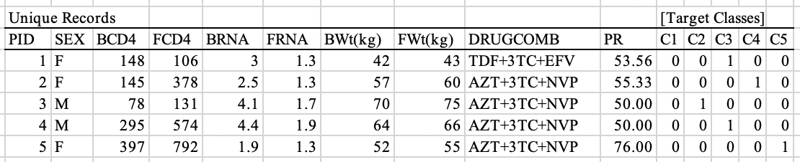

```{r setup, include = FALSE}
if(!require(knitr)) install.packages("knitr", repos = "http://cran.us.r-project.org") # require() checks if the package exists
library(knitr)
opts_chunk$set(
	echo = FALSE,
	collapse = TRUE,
	warning = FALSE,
	message = FALSE,
	out.width = "50%",
	fig.align = "center"
)
```


## Introduction


This undertaking is part of the capstone in the [Professional Certificate Program in Data Science of Harvard Online](https://www.harvardonline.harvard.edu/course/data-science-professional-certificate). The corresponding R Markdown and R files are in the [GitHub of nsmacaspac](https://github.com/nsmacaspac/91capstone-project-all-learners).


## Unique Records of the Akwa Ibom HIV Database


In a previous study on patient response to antiretroviral therapy, Ekpenyong, Etebong, and Jackson (2019, 3) used a database of patients who received treatment for HIV from thirteen health centers in Akwa Ibom, Nigeria, between 2015 and 2018. Two years later, they published the processed dataset (Ekpenyong et al. 2021b, Appendix) with minor oversight in the accompanying article, which were easily reconciled through the 2019 study and were appropriately referenced throughout this project. The processed dataset was composed of an Individual Treatment Change Episodes table with a column for each antiretroviral drug administered and a concatenated Unique Records table with the drugs combined into a column for each antiretroviral therapy of three drugs administered. For the purpose of this project, we utilize only the Unique Records table.

The Unique Records table was imported with the corresponding read_xlsx function in the language R. The dataset was composed of 1,056 patient records, each with 15 variables: patient identification, sex, baseline CD4 count, follow-up CD4 count, baseline RNA load, follow-up RNA load, baseline weight, follow-up weight, drug combination, and patient response and drug reaction classifications 1 to 5 (fig. 1). The immunological marker CD4 counts were given in cells per cubic millimeter (Ekpenyong et al. 2021a, 8). The viral RNA loads were expressed in times 10^2^ copies (Ekpenyong, Etebong, and Jackson 2019, 10). The weights ranged from 4.7 to 125 kg on account of the presence of pediatric patients (Ekpenyong, Etebong, and Jackson 2019, 2). The three-drug combinations of antiretroviral therapy were a complementary mix of nucleoside reverse transcriptase inhibitors tenofovir (TDF), lamivudine (3TC) and zidovudine (AZT), and non-nucleoside reverse transcriptase inhibitors efavirenz (EFV) and nivarapine (NVP) given in the first 6 months of treatment (Ekpenyong et al. 2021a, 8). Patient response and reaction to the drugs were quantified and classified with a binary system as very high interaction (C1), high interaction (C2), low interaction (C3), very low interaction (C4), and no interaction (C5) in the 2019 study using the advanced method of interval type-2 fuzzy logic system (Ekpenyong, Etebong, and Jackson 2019, 11). Very high and high interactions signified treatment failure as well (Ekpenyong, Etebong, and Jackson 2019, 10).

```{r}
options(timeout = 120) # timeout in seconds for some Internet operations
if(!file.exists("mmc1.xlsx")) download.file("https://www.ncbi.nlm.nih.gov/pmc/articles/PMC8142042/bin/mmc1.xlsx", "mmc1.xlsx")

if(!require(readxl)) install.packages("readxl", repos = "http://cran.us.r-project.org") # require() checks if the package exists
library(readxl)
dataset <- as.data.frame(read_xlsx("mmc1.xlsx", range = "N27:AB1083")) # range reads the Unique Records table, which is the combined version of the Individual Treatment Change Episodes table
```

```{r fig1, fig.cap = "First rows of the Unique Records table."}

```


## Tidy and Preprocessed Dataset


The dataset was prepared for preprocessing by rendering it into tidy and numeric format. The fifteen variables were renamed for consistency with their aforementioned descriptions, with vhi_tf corresponding to very high interaction_treatment failure and ni corresponding to no interaction. Missing values were not detected.

```{r}
colnames(dataset) <- c("id", "sex", "bcd4", "fcd4", "brna", "frna", "bweight", "fweight", "therapy", "response", "vhi_tf", "hi_tf", "li", "vli", "ni")
```

```{r, echo = TRUE}
head(dataset, n = 5)
```

The sex and therapy variables were changed from character to numeric format using the case_when function. The brna and frna variables were multiplied by 10^2^ to align with the unit used for viral RNA load in the WHO definition of HIV (WHO, n.d.). The vhi_tf, hi_tf, li, vli, and ni variables were verified to have only one value per row. Hence, they were merged under a newly defined reaction variable then relabeled as 5 (vhi_tf) to 1 (ni). This brought the number of variables down to eleven.

```{r}
if(!require(tidyverse)) install.packages("tidyverse", repos = "http://cran.us.r-project.org")
library(tidyverse)
```

```{r, echo = TRUE}
dataset1 <- dataset |>
  mutate(sex = ifelse(sex == "F", 1, 2)) |> # relabels sexes as 1-2
  mutate(brna = brna*10^2) |>
  mutate(frna = frna*10^2) |>
  mutate(therapy = case_when(therapy == "AZT+3TC+EFV" ~ 1,
                             therapy == "AZT+3TC+NVP" ~ 2,
                             therapy == "TDF+3TC+EFV" ~ 3)) |> # relabels antiretroviral therapies as 1-3
  mutate(reaction = case_when(vhi_tf == 1 ~ 5,
                              hi_tf == 1 ~ 4,
                              li == 1 ~ 3,
                              vli == 1 ~ 2,
                              ni == 1 ~ 1,)) |> # relabels drug reactions as 5-1 then merges them under column reaction
  select(-vhi_tf, -hi_tf, -li, -vli, -ni)
head(dataset1, n = 5)
```


Given that all values were then in numeric format, the correlation of the variables was examined using the corrplot function (fig. 2).

-the distribution summaries 
-the variance

```{r fig2, fig.cap = "Matrix of the correlation coefficients between variables."}
if(!require(corrplot)) install.packages("corrplot", repos = "http://cran.us.r-project.org")
library(corrplot)
corrplot(cor(dataset1), method = "square", diag = FALSE, addCoef.col = "gray", tl.col = "black", number.cex = 0.4, number.digits = 2) # shows the correlation of all variables
```

CD4 counts and RNA loads 

The dataset was preprocessed to retain only CD4 counts and RNA loads


### _CD4 Count_


### _RNA Load_


## Classification Models


- why this partition


### _k-Nearest Neighbor Model_


- why this model


### _Recursive Partitioning and Regression Trees Model_


### _Rborist Model_


### _Quadratic Discriminant Analysis Model_


## Predictive Model


## Conclusion


-meaningful decisions on antiretroviral therapy administration


## References


Ekpenyong, Moses E., Mercy E. Edoho, Ifiok J. Udo, Philip I. Etebong, Nseobong P. Uto, Tenderwealth C. Jackson, and Nkem M. Obiakor. 2021a. "A Transfer Learning Approach to Drug Resistance Classification in Mixed
HIV Dataset." _Informatics in Medicine Unlocked_ 24: 100568. [https://doi.org/10.1016/j.imu.2021.100568](https://doi.org/10.1016/j.imu.2021.100568).

Ekpenyong, Moses E., Philip I. Etebong, and Tenderwealth C. Jackson. 2019."Fuzzy-Multidimensional Deep Learning for Efficient Prediction of Patient Response to Antiretroviral Therapy." _Heliyon_ 5: e02080. [https://doi.org/10.1016/j.heliyon.2019.e02080](https://doi.org/10.1016/j.heliyon.2019.e02080).

Ekpenyong, Moses E., Philip I. Etebong, Tenderwealth C. Jackson, and Edidiong J. Udofa. 2021b."Processed HIV Prognostic Dataset for Control Experiments." _Data in Brief_ 36: 107147. [https://doi.org/10.1016/j.dib.2021.107147](https://doi.org/10.1016/j.dib.2021.107147).

Irizarry, Rafael A. 2002. _Introduction to Data Science: Data Analysis and Prediction Algorithms with R_. [http://rafalab.dfci.harvard.edu/dsbook/](http://rafalab.dfci.harvard.edu/dsbook/).

WHO, n.d. "HIV." Accessed July 21, 2023. [https://www.who.int/health-topics/hiv-aids#tab=tab_1](https://www.who.int/health-topics/hiv-aids#tab=tab_1).
